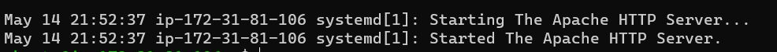
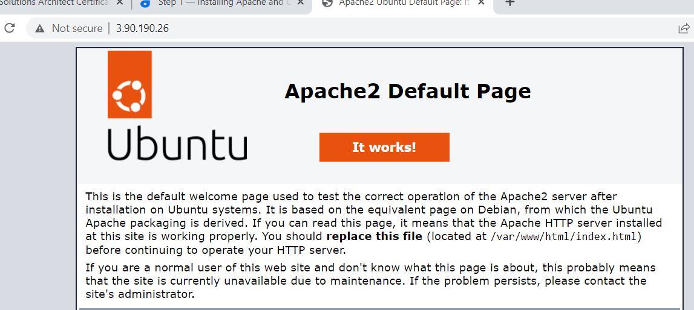
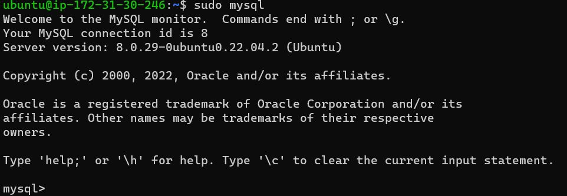
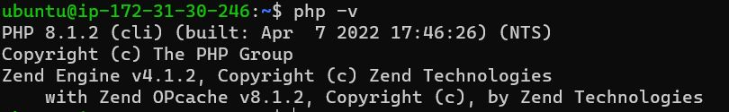
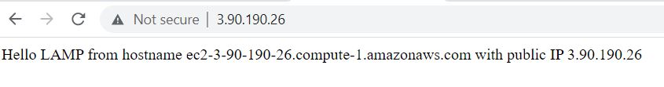
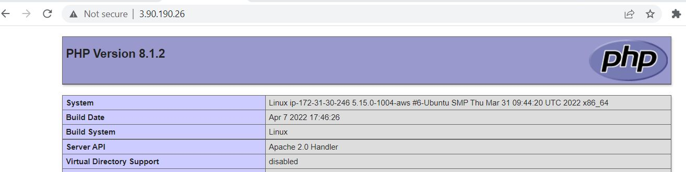

### DOCUMENTATION OF PROJECT 1
`sudo apt update`

`sudo install apache2`

`sudo systmctl apache2`

## Apache running using pub ip on port 80
`http://3.90.190.26:80`

## Installing mysql server
`sudo apt install mysql-server`

`sudo mysql`

## Secure the mysql installation
#done
## Installing PHP

`sudo apt install php libapache2-mod-php php-mysql`

#Verify PHP version

`php -v`

## Creating a virtual host 

`sudo mkdir /var/www/projectlamp`

`sudo chown -R $USER:$USER /var/www/projectlamp`

`sudo vi /etc/apache2/sites-available/projectlamp.conf`

`<VirtualHost *:80>
    ServerName projectlamp
    ServerAlias www.projectlamp 
    ServerAdmin webmaster@localhost
    DocumentRoot /var/www/projectlamp
    ErrorLog ${APACHE_LOG_DIR}/error.log
    CustomLog ${APACHE_LOG_DIR}/access.log combined
</VirtualHost>`

##ENABLE THE NEW VIRTUAL HOST

`sudo a2ensite projectlamp`

##Disable the default apache landing page

`sudo a2dissite 000-default`

`sudo apache2ctl configtest`

`sudo systemctl reload apache2`

`sudo echo 'Hello LAMP from hostname' $(curl -s http://169.254.169.254/latest/meta-data/public-hostname) 'with public IP' $(curl -s http://169.254.169.254/latest/meta-data/public-ipv4) > /var/www/projectlamp/index.html`

`http://3.90.190.26:80`

##ENABLE PHP
#Order directoryIndex

`sudo vim /etc/apache2/mods-enabled/dir.conf`

`<IfModule mod_dir.c>
        #Change this:
        #DirectoryIndex index.html index.cgi index.pl index.php index.xhtml index.htm
        #To this:
        DirectoryIndex index.php index.html index.cgi index.pl index.xhtml index.htm
</IfModule>`

`sudo systemctl reload apache2`

`vim /var/www/projectlamp/index.php`

`<?php
phpinfo();`

